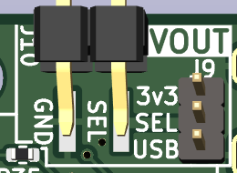

# Features

This page details the feature-set and pin-mapping at a high-level.

## Pinout

?>The following has been reproduced for ease of access, the schematic is the source of truth.

| RP2350 GPIO     | Function   |
|:---------------:|:----------:|
| GPIO0           | UART0 TX   |
| GPIO1           | UART0 RX   |
| GPIO2           | UART0 LED  |
| GPIO3           | USR SW     |
| GPIO4           | RP_PWR_LED |
| GPIO5           | Spare, TP  |
| GPIO6           | Spare, TP  |
| GPIO7           | Spare, TP  |
| GPIO8           | UART1 LED  |
| GPIO9           | Spare, TP  |
| ...             | ...        |
| GPIO15          | Spare, J11 |
| GPIO16          | Spare, J11 |
| GPIO17          | Spare, J11 |
| GPIO18          | Spare, J11 |
| GPIO19          | UART2 LED  |
| GPIO20          | UART1 TX   |
| GPIO21          | UART1 RX   |
| GPIO22          | UART2 TX   |
| GPIO23          | UART2 RX   |
| GPIO24          | SPI1 MISO, I2C0 SDA |
| GPIO25          | SPI1 CSn, I2C0 SCL  |
| GPIO26          | SPI1 SCK, I2C1 SDA  |
| GPIO27          | SPI1 MOSI, I2C1 SCL |
| GPIO28          | UART3 RX   |
| GPIO29          | UART3 TX   |
| GPIO30          | UART3 LED  |
| ...             | ...        |
| GPIO32          | UART4 RX   |
| GPIO33          | UART4 TX   |
| GPIO34          | UART4 LED  |
| ...             | ...        |
| GPIO40          | Spare, TP  |
| GPIO41          | Spare, TP  |
| GPIO42          | Spare, TP  |
| ...             | ...        |
| GPIO45          | UART4 LED  |
| GPIO46          | UART4 RX   |
| GPIO47          | UART4 TX   |

---

## Interfaces

The following sections will cover detail of various interfaces across the board.

>[!TIP]
>I _try_ to maintain the logic of not having `hot` pins.  
>This means that where possible, anything providing a supply voltage will be in the form of a socket. Conversely, anything to be supplied a voltage will be presented as a header.  
>N.B. J10 is shown in renders as a header - It is a socket in the BoM. Its selection jumper, J9, is a 1.27 pitch for convenience.

---
### LEDS

There are three LEDs on the board which aren't for use with the ISO UARTS, these are:

1. USR - This is a user controllable LED, nominally used to indicate when the MCU has booted into user code
1. USB - This LED is tied to VBUS on the USB connector to indicate presence of power.
1. 3v3 - This is tied to the 3v3 line to indicate that the LDO is functional.

### Buttons

#### BOOT

The BOOT button is used to put the MCU into USB bootloader mode in order to load *.UF2 files. Simply hold the button whilst powering on the board, then the board will present as a mass-storage device.

>[!TIP]
>Once booted, the button can act as a user input connected to `GPIO3`.

#### RESET

The reset button resets the device

### USB (J1)

The USB-C connector provides power to the board and is the primary mechanism for programming the board.  
Doing the boards intended use-case, the USB connector is also used for the data handling for the CDC ACM endpoints (i.e. your PC providing multiple COM ports for accessing each of the UARTs on-board).

---

### Isolated UARTs (J2, J3, J4, J5, J6, J7)

The isolated UARTs are provided by six 4 pin, 2.54 pitch, headers around the edge. The isolators connected to these headers `must` be fed with a voltage and ground by **each** device under test, otherwise the UART comms will not be passed to the MCU.

- Supply voltage on VCC for `UART`[`0` .. `5`] is 2.375 .. 5.5V  
   - The isolators are also providing level translation and will support logic from 2v0 to 5v5.

>[!NOTE]
>If you require 1v8 logic -> A drop-in replacement isolator is the [MAX12931](https://www.analog.com/media/en/technical-documentation/data-sheets/max12930-max12931.pdf).  
>This part is significantly higher cost, hence not the default.

---

### I2C / SPI / Breakout (J8, J11, TPs)

The board includes some additional connection options for users to experiment with.

#### J8

J8 _nominally_ provides access to either `SPI0` _or_ `I2C0` & `IC21`. Additionally, the header provides 3v3 supply and GND connections.

J12 .. J15 provides optional pull-up / pull-down configuration for each pin by jumpering the desired end to the centre pin.

>[!TIP]
>These pins could be used for GPIO.

#### Spare IO

The board includes a few test points and a header which could be used for more signals if required.

1. 5, 6, 7, 9 are available for GPIO on test points, 15, 16, 17, 18 are available on J11.
   1. 
1. 40, 41, 42 are available for ADCs.
   1. 
1. Programming test points are grouped near the MCU.
   1. 

### VOut (J10)

J10 is provided as a convenient power access for lower power devices or for monitoring supply voltages.  
The voltage on J10 can be selected, using J9. The options are 3v3 or USB.

>[!WARNING]
>J10 _could_ be used to power the board, up-to 20V, when jumpered to USB, or a direct 3v3, bypassing the LDO (U1), if required.  
>If powering via the USB jumper option, note that USB LED, D9, is tied to this line and has 1kR in series.
